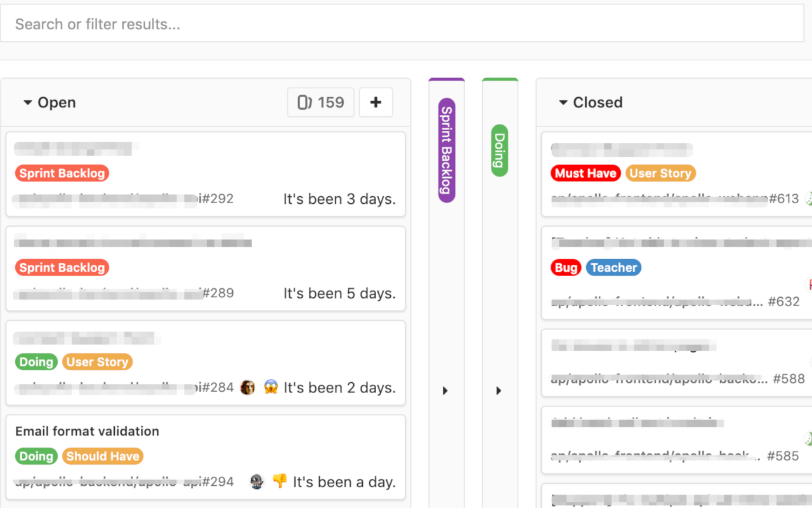

# GitLabrador
This Chrome extension allows you to fold any board in your GitLab issue board. It also adds humanized last updated date and estimate of each issues.

## How do I use it?
1. Clone this repo `git clone git@github.com:himalay/GitLabrador.git`
1. Open **Extensions page** in Chrome browser by entering `chrome://extensions` in address bar
1. Enable Developer mode from top-right corner of **Extensions** page
1. Click on **Load unpacked** button on top-left corner of **Extensions page**
1. Select previously cloned **GitLabrador** folder
